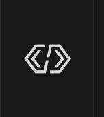

# Autonomous routines using Choreo

We've used the [AutoRoutine](https://choreo.autos/choreolib/auto-factory/#using-autoroutine) method of Choreo in prior years. This guide covers that technique. See the Choreo docs for info on other ways to use the library.

1. Install Choreo into your project
1. Create an Autos.java file
1. Create a Routines.java file
1. Update robot.java to instantiate the Autos and Routines classes
1. Draw your path in Choreo
1. Update Autos.java & Routines.java to implement the path

## Install Choreo into your project

With your project open, click the diamond-shaped button on the lower left side of the VSCode window.



Find Choreo in the list. Click Install. Build your project.

## Create an Autos.java file

The Autos.java file will contain both your auto commands as well as the code to put the list of autos onto the driver dashboard. Generally, this file would go in a commands folder if you have one in your project.

Some boilerplate code follows, but you should check out a previous year's robot code to get more context and detail.

```java
package org.team1518.robot.commands;

import choreo.auto.AutoChooser;
import choreo.auto.AutoFactory;
import choreo.auto.AutoRoutine;
import choreo.auto.AutoTrajectory;
import edu.wpi.first.wpilibj.smartdashboard.SmartDashboard;
import edu.wpi.first.wpilibj2.command.Command;
import edu.wpi.first.wpilibj2.command.Commands;
import edu.wpi.first.wpilibj2.command.button.RobotModeTriggers;
import org.team1518.robot.Constants;
import org.team1518.robot.Robot;
import org.team1518.robot.commands.your_commands_to_operate_the_robot;
import org.team1518.robot.subsystems.Swerve;

/**
 * The Autos class declares autonomous modes, and adds them
 * to the dashboard to be selected by the drive team.
 */
public final class Autos {

    private final Swerve swerve;  // represents your swerve drive subsystem
    private final Routines routines; // the Routines you will use
    private final AutoFactory factory; // Part of Choreo, you need an AutoFactory
    private final AutoChooser autoChooser; // better than using SendableChooser

    public Autos(Robot robot) {
        swerve = robot.swerve;
        routines = robot.routines;

        // Create the required auto factory
        factory = new AutoFactory(
            swerve::getPose, // function to get the robot's current pose
            swerve::resetPose, // function to reset the pose
            swerve::followTrajectory, // function to follow a Trajectory
            true, // If alliance flipping should be enabled
            swerve // your swerve drive subsystem
        );

        // Create the auto chooser
        autoChooser = new AutoChooser();

        // Add options to the chooser
        autoChooser.addCmd("Example Auto Command", this::example);

        // Put the auto chooser on the dashboard
        SmartDashboard.putData(autoChooser);

        // Schedule the selected auto during the autonomous period
        RobotModeTriggers.autonomous().whileTrue(autoChooser.selectedCommandScheduler());

        // An example Command -- an auto script. You'll have one of these for
        // each auto you want to run.
        private Command example() {
            AutoRoutine routine = factory.newRoutine("Example");
            // read in the path you created in the Choreo UI named 'example'
            AutoTrajectory exampleTrajectory = routine.trajectory("example");

            // this is the sequence of tasks to perform when the auto routine becomes active
            // in other words, when the autonomous period begins
            routine.active().onTrue(
                sequence(
                    exampleTrajectory.resetOdometry(), // always start by resetting odometry
                    exampleTrajectory.cmd() // this runs your path
                )
            );
            exampleTrajectory.done().onTrue(
                sequence(
                    routines.stopBot(), // see the Routines.java file for this routine
                    swerve.finishAuto() // always end with finishAuto() assuming your swerve class has one
                )
            );
            return routine.cmd();
        }
    }
}
```

## Create a Routines.java file

The Routines.java file will contain routines, which are series of commands your robot will perform. You don't actually have to use routines. You could directly code the steps of a routine into the Autos.java commands (like the `example()` above). Routines simply hide some of the details by wrapping them in a separate class. Routines are also reusable.

Some boilerplate code follows, but you should check out a previous year's robot code to get more context and detail.

```java
package org.team1518.robot.commands;

import static edu.wpi.first.wpilibj2.command.Commands.*;

import edu.wpi.first.wpilibj2.command.Command;
import org.team1518.robot.Robot;
import org.team1518.robot.subsystems.Swerve;

/**
 * The Routines class contains command compositions, such as sequences
 * or parallel command groups, that require multiple subsystems.
 */
@Logged(strategy = Strategy.OPT_IN)
public final class Routines {

    private final Swerve swerve;

    public Routines(Robot robot) {
        swerve = robot.swerve;
    }

    /**
     * An example routine. This one is called from our sample Autos.java file's `example()` command.
     */
    public Command stopBot() {
        return sequence(
            print("Hello from the stopBot() routine!"),
            swerve.stop(true)
        ).withTimeout(1.0).withName("Routines.stopBot()");
    }

    /**
     * Taken from a GRR project, this demonstrates a more complex routine.
     * You can't copy and paste this one and have it work since it relies
     * on their code. It's just here as an example of parallel() and nested
     * sequences.
     *
     * Aims the drive at the speaker and shoots a note.
     * The pivot and shooter wheels are expected to be\[]
     * already running and targeting the speaker.
     */
    private Command shoot(double delay, double timeout) {
        return parallel(
            intake.apply(IntakeState.kRetract),
            sequence(waitSeconds(delay), feeder.apply(FeederSpeed.kShoot)),
            swerve.driveSpeaker(() -> 0.0, () -> 0.0)
        )
            .withTimeout(timeout)
            .withName("Autos.shoot(" + timeout + ")");
    }
}
```

## Update robot.java

You need to update your robot.java file to import and instantiate your autos and routines. A skeleton of the needed code is:

```java
...
import org.team1518.robot.commands.Autos;
import org.team1518.robot.commands.Routines;
...

public final class Robot extends TimedRobot {
    ...
    // declare your Auto routines and Autos class
    public final Routines routines;
    public final Autos autos;

    public Robot() {
        ...
        // Initialize Auto routines and Autos class
        routines = new Routines(this);
        autos = new Autos(this);

        ...
    }
}
```

## Draw your Choreo paths

Open the Choreo application. Following the instructions on the [Choreo documentation site](https://choreo.autos/usage/editing-paths/), create your paths.

Save your Choreo paths to the `src/main/deploy/choreo` folder in your project. The Choreo UI will automatically re-open the last-used file. This means when you start a new year's project, you'll open Choreo and it will open the previous year's file. Do a Save As... to move it to the current year's project, _then_ delete the paths. Otherwise, you'll be modifying the previous year's project.

## Update Autos.java & Routines.java to implement the path

Once you've drawn a path or paths, you'll need to update both Autos.java and probably Routines.java. In Autos.java, you will:

- Create a new command with your sequence of steps. See `example()` for reference.
- Update the AutoChooser code to add your new command to the dashboard.

If you use Routines.java (rather than coding the "stop steps" directly in your Autos.java command), you'll need to create a new command in Routines.java. See the `example()` there for reference.

# Notes and tips:

Choreo recommends creating multiple paths for complex operations. For example, if you want to drive to point A, do something (like shoot), then drive to point B, you would create two paths in the Choreo UI. Each would have it's own name. Then, in your Autos.java command, you would create a sequence to drive path A, do whatever (like shoot), then drive path B.

You don't need to use Routines.java. You can instead add whatever steps you would put in a routine directly in the Autos.java command. Routines can be reused however. So, you could share a single routine across multiple autos.

See the Choreo [AutoRoutine docs](https://choreo.autos/choreolib/auto-factory/#using-autoroutine) for more advanced examples, such as using triggers other than `.done()` as well as autos that branch based on conditions (like whether the bot is holding a gamepiece).
